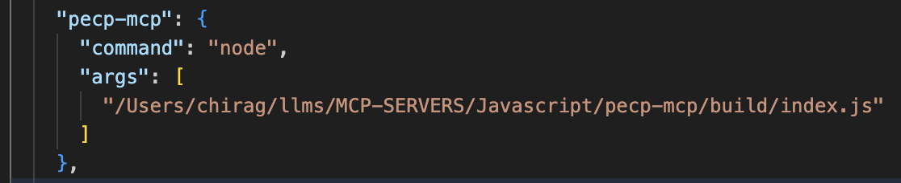

# PECP-MCP

A Model Context Protocol (MCP) server implementation in Node.js/TypeScript for the "PECP" use case. This project provides a simple, extensible server with helper utilities, designed for integration with MCP-compatible clients and workflows.

## Features
- Written in TypeScript for type safety and maintainability
- Modular structure with separate helper utilities
- Build output in `build/` directory
- Easily extensible for new endpoints and logic

## Project Structure
```
pecp-mcp/
├── src/            # TypeScript source files
│   ├── index.ts    # Main entry point
│   └── helper.ts   # Helper utilities
├── build/          # Compiled JavaScript output
│   ├── index.js
│   └── helper.js
├── package.json    # Project metadata and scripts
├── tsconfig.json   # TypeScript configuration
└── .gitignore      # Git ignore rules
```

## Getting Started

### Prerequisites
- Node.js (v16+ recommended)
- npm (v8+ recommended)

### Installation
1. Clone the repository:
   ```sh
   git clone <repo-url>
   cd pecp-mcp
   ```
2. Install dependencies:
   ```sh
   npm install
   ```

### Build
To compile the TypeScript source files to JavaScript:
```sh
npm run build
```
The compiled files will be output to the `build/` directory.


## Add this config in your claude_desktop_config.json



## Usage
You can run the server (or scripts) using Node.js:
```sh
node build/index.js
```

## Development
- Source code is in the `src/` directory.
- Edit `.ts` files and run `npm run build` to recompile.
- Add new features or endpoints by extending `src/index.ts` and `src/helper.ts`.

## Scripts
- `npm run build` — Compile TypeScript to JavaScript
- `npm start` — (If defined) Start the server

## License
See [LICENSE](LICENSE) for license information.

## Contributing
Pull requests and issues are welcome! Please open an issue to discuss your ideas or report bugs.
